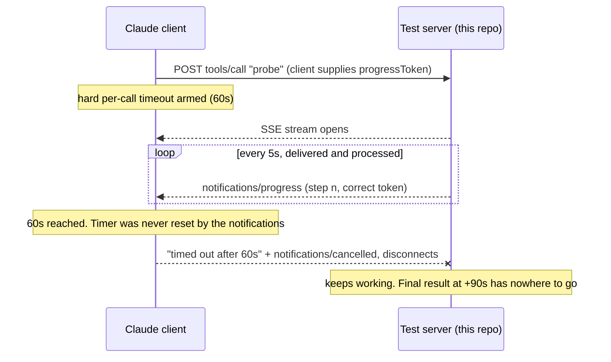
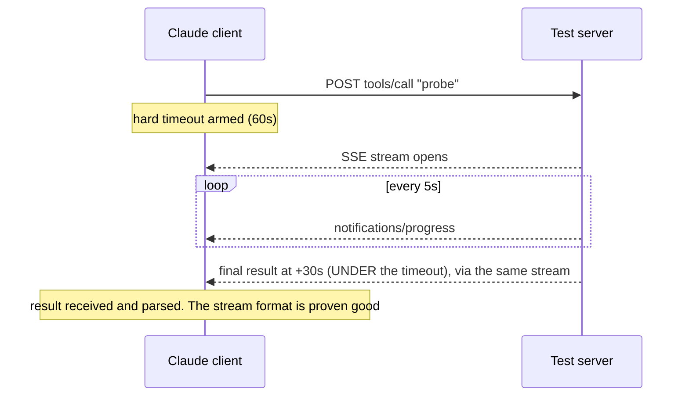
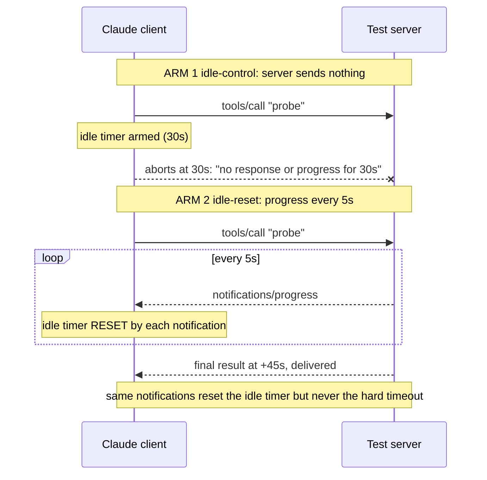
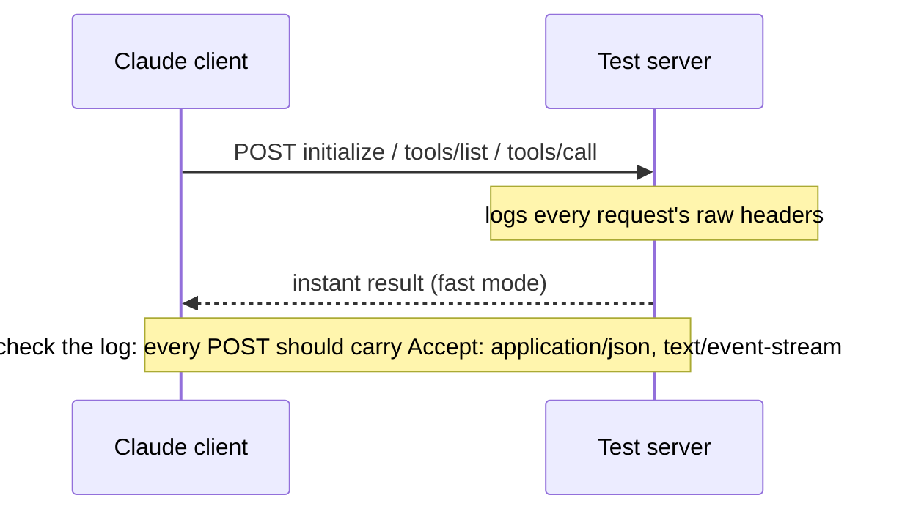
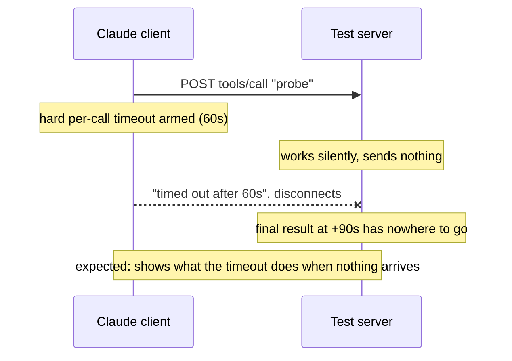
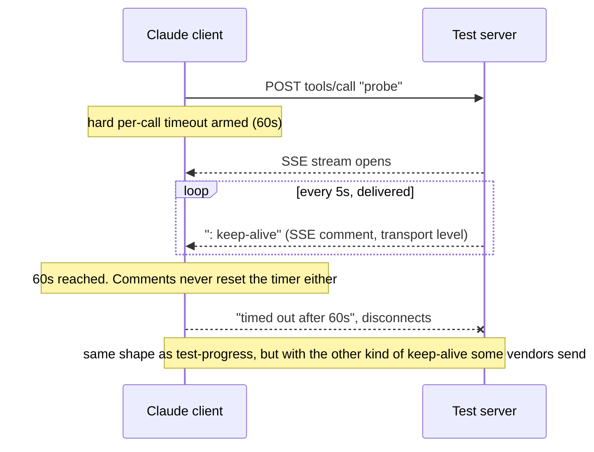

# mcp-client-testbench

**The question this repo answers:** when an MCP tool call takes a long time,
what does the Claude client actually do, and does anything the server sends
(progress notifications, keep-alives) stop it from timing out?

**Why it exists:** Claude Code and Claude Cowork abort MCP tool calls that
exceed a timeout (observed: 60 seconds for claude.ai connectors). Server
vendors say "we send keep-alives so long calls stay alive". This rig tests
whether that actually works, against a server you fully control, with no
vendor infrastructure in the way.

## What happens when you run a test

Every `make test-*` target does the same five things:

1. Starts a tiny MCP server on localhost (`server.py`, stdlib Python, no
   installs). It has one tool, `probe`, which takes a configurable amount
   of time and streams configurable events while it works.
2. Writes a scoped MCP config pointing a client at that server, with a
   configurable per-server `timeout`.
3. Launches a REAL headless Claude session (`claude -p ...`) that connects
   to the server and calls `probe` once. This is the actual Claude client
   binary on your machine, not a simulation. It costs a few cents of model
   usage per run (defaults to haiku; the model doesn't affect timeout
   behaviour).
4. The server logs every request's headers and a timestamped timeline of
   every event it sends and when the client hangs up.
5. Prints: what the client reported, the server's timeline, and a one-line
   verdict. Full logs plus a structured `<scenario>_result.json` (verdict,
   client version, timings, events sent) go to `./results/` (gitignored),
   so runs can be compared across client versions.

## The scenarios

| Target | Server behaviour | What it tells you |
|---|---|---|
| `make test-headers` | responds instantly | The exact headers the client sends. Spec compliance check: every POST should carry `Accept: application/json, text/event-stream` |
| `make test-silent` | takes 90s, sends nothing | Control case: confirms what the configured timeout does when nothing arrives. EXPECTED to time out |
| `make test-progress` | takes 90s, sends spec-compliant JSON-RPC `notifications/progress` every 5s | The key question: do protocol-level progress notifications extend the client's timeout? |
| `make test-sse-comments` | takes 90s, sends SSE comment keep-alives (`: keep-alive`) every 5s | Same question for transport-level keep-alives (what some vendors mean by "keep-alives") |
| `make test-control` | streams the same way as test-progress but finishes UNDER the timeout (half of TIMEOUT_MS) | Delivery control: if the result arrives, the client demonstrably parses this server's SSE stream, ruling out "malformed stream" as the explanation for the timeout scenarios |
| `make test-idle` | two runs with the client's idle timeout set to 30s and a 45s tool: one sending nothing, one sending progress every 5s | Proves the client PROCESSES the notifications, not just parses them: the no-progress run must idle-abort at 30s, the progress run must survive to 45s because the notifications reset the client's own idle timer |
| `make test-all` | all of the above | ~7-8 minutes total |

## The core scenario, as a picture

`test-progress`, the scenario that demonstrates the finding:



<details>
<summary>Diagram: the delivery control (test-control), proving the stream is consumable</summary>



</details>

<details>
<summary>Diagram: the idle pair (test-idle), proving the notifications are processed</summary>

Both runs set the client's separate idle timer to 30s and use a 45s tool.



</details>

<details>
<summary>Diagram: header capture (test-headers)</summary>



</details>

<details>
<summary>Diagram: the baseline control (test-silent)</summary>



</details>

<details>
<summary>Diagram: SSE comment keep-alives (test-sse-comments)</summary>



</details>

## Two different timers (do not confuse them)

The Claude client runs two separate timers on every MCP tool call:

1. **The hard per-call timeout.** A fixed cap on the whole call (set via
   the per-server `timeout` config or the `MCP_TOOL_TIMEOUT` env var;
   observed at 60000ms for claude.ai connectors). **This is the timer this
   repo's finding is about**: nothing the server streams extends it. The
   `silent`, `progress`, and `sse-comments` scenarios test this timer.
2. **The idle timeout.** A separate "is the server still alive?" timer
   (`CLAUDE_CODE_MCP_TOOL_IDLE_TIMEOUT`, default 5 min for HTTP) that DOES
   reset when progress notifications arrive. The `idle-control` and
   `idle-reset` scenarios use this timer purely as an instrument: because
   it resets on our notifications, it proves the client processes them.

Do not read `idle-reset` succeeding as "keep-alives fix the timeout
problem". It only proves the notifications are delivered and acted on.
The finding is precisely that the hard per-call timeout (timer 1) ignores
the same notifications that demonstrably reset timer 2.

## Reading the output

Example (`make test-progress`), annotated:

```
=== progress (mode=progress, duration=90s, timeout=60000ms, interval=5s) ===
claude version: 2.1.246 (Claude Code)      <- results are per client version
--- client said:
    MCP server "testbench" tool "probe" timed out after 60s   <- the client's outcome
--- server timeline (sends + disconnects):
    ... tools/call received, progressToken=2   <- client DID request progress
    ... sent progress notification 1 at +5s    <- server WAS streaming
    ... sent progress notification 11 at +55s
--- verdict:
    CLIENT TIMED OUT: timed out after 60s
    Progress notifications were being delivered (see timeline) but did NOT extend the timeout.
```

A passing (extended-timeout) run would instead end with the client
reporting `PROBE_COMPLETED_OK after 90s`.

## Baseline results (claude-code 2.1.246, Aug 2026)

| Scenario | Result |
|---|---|
| headers | PASS: spec-compliant Accept headers on every request |
| control-under-timeout | DELIVERED: result received through the same SSE stream that carries the progress notifications, so the stream is consumable |
| silent | Times out at the configured limit (expected control) |
| progress | Times out at exactly the configured limit despite delivered notifications |
| sse-comments | Times out at exactly the configured limit despite delivered keep-alives |
| idle-control | Idle-aborts at 30s (expected: idle timer armed) |
| idle-reset | DELIVERED at 45s: the progress notifications reset the client's idle timer, proving the client fully processes them |

Conclusion: the client demonstrably processes this server's progress
notifications (they reset its idle timer), yet its hard per-call timeout is
not extended by them or by SSE keep-alives.
Matches https://github.com/anthropics/claude-code/issues/58687.

One positive: the per-server `timeout` value in the MCP config IS honored
for directly-configured servers, so local CLI users can raise their own
cap. Connector users (claude.ai / Cowork) cannot; the platform sets it.

## How the scenarios combine into one argument

Each scenario is verified by the one before it, so no step relies on
trusting this rig's correctness:

1. `headers` shows the client asks for streams correctly.
2. `control-under-timeout` shows the client parses this server's stream
   end to end.
3. `silent` shows the timeout's baseline behaviour when nothing arrives.
4. `idle-control` and `idle-reset` show the client PROCESSES the progress
   notifications: they reset its separate idle timer, which the control
   proves is armed. This rules out "notifications silently discarded".
5. `progress` and `sse-comments` then isolate the finding: notifications
   the client demonstrably acts on do not extend the hard per-call timeout,
   which fires at exactly the configured limit regardless.

## Prerequisites

- Claude Code CLI installed and logged in (`claude --version` works)
- Python 3.10+ (stdlib only, nothing to install), make
- macOS or Linux

## Quick start

```bash
make            # menu
make test-all   # everything
```

## Running it against Claude Code vs Cowork

**Claude Code (local CLI):** clone the repo on the machine where Claude Code
is installed and run `make test-all`. This tests that machine's client.

**Cowork:** Cowork sessions run in Anthropic's cloud, not on your machine,
so they cannot reach a server on your laptop's localhost. Two options:

1. Test the Cowork client engine: in a Cowork session, connect this repo's
   folder and ask Claude to copy the repo contents into its session
   environment and run `make test-all` there. The headless client inside
   the Cowork environment is the same engine Cowork itself uses (the
   header capture will show `remote_cowork` in the User-Agent). This
   covers timeout and streaming behaviour of the Cowork client.
2. Test the full Cowork connector path, Anthropic's connector platform
   included: use the tunnel method described at the bottom of this README,
   then call the `probe` tool from a normal Cowork session via the
   registered connector.

Option 1 tests the client only. Option 2 additionally tests what the
connector platform forwards and whether it passes streams through. Note
that in Cowork the per-server `timeout` is set by the platform, not by
you, so option 2 runs against the platform's own timeout config.

## Tunables

Pass as make variables or environment variables,
e.g. `make test-progress TIMEOUT_MS=30000 DURATION=45`:

| Variable | Default | Meaning |
|---|---|---|
| `TIMEOUT_MS` | 60000 | per-server `timeout` in the MCP config given to the client |
| `DURATION` | 90 | seconds the probe tool takes to complete |
| `INTERVAL` | 5 | seconds between progress/keep-alive events |
| `PORT` | 8765 | local server port |
| `CLAUDE_MODEL` | haiku | model for the headless session |

## Limitation, and the connector-platform extension

Run locally, this tests the DIRECT client-to-server leg only. Connector
traffic in claude.ai/Cowork additionally passes through Anthropic's
connector platform, which this rig does not see. To point the same
instrument at that platform:

1. Expose the server publicly: `cloudflared tunnel --url http://127.0.0.1:8765`
2. Have your Claude org admin register the tunnel URL as a custom connector.
3. Call the `probe` tool from a normal Claude session via that connector.
4. The server's logged headers are now what the PLATFORM sends, and the
   timeline shows whether it passes streams through or buffers them.
5. Tear the connector and tunnel down afterwards. The server has no auth;
   expose it only briefly and only for this purpose.

## Layout

- `server.py` - the configurable MCP server (standalone: `python3 server.py --help`)
- `testbench.py` - orchestrates the scenarios (`python3 testbench.py --help`);
  make is just a convenience wrapper around it
- `Makefile` - the scenario shortcuts
- `results/` - logs, verdicts, structured JSON results, generated MCP configs (gitignored)
